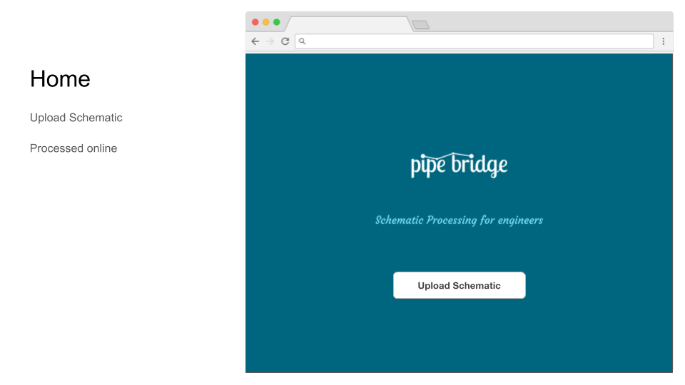
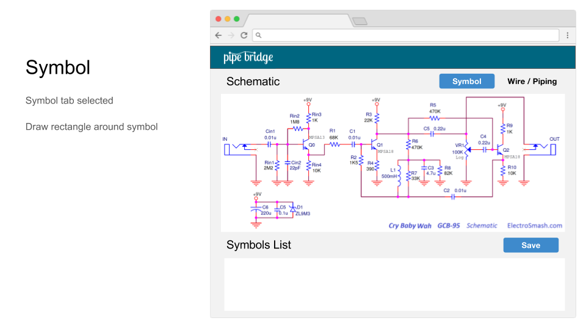
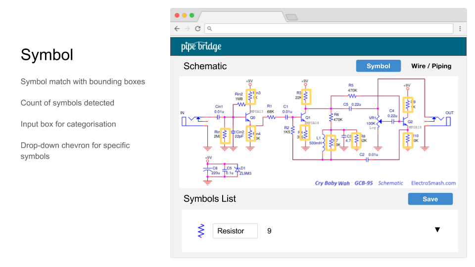
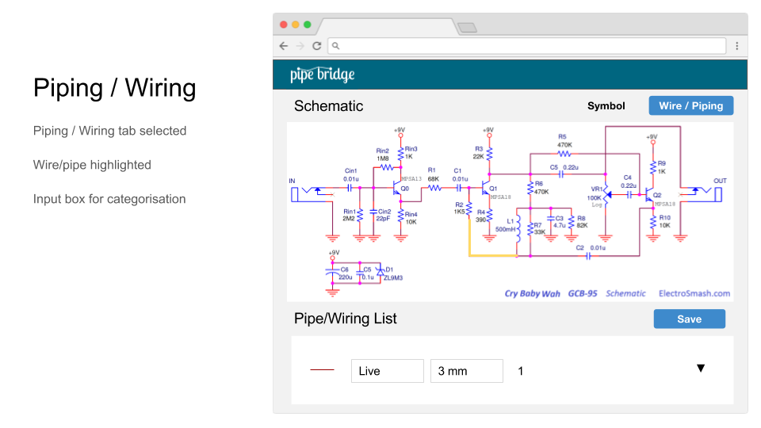

[Website](http://) • [Docs](https://) • [Support](https://)

**Pipe Bridge - Schematic Diagram Processing Service** – Batch process schematic diagrams in seconds using a cloud based computer vision system. Engineers can be more productive as they no longer need to spend hours identifing and counting symbols on schematic diagrams. This enables your engineering team to focus on more technical challenges and not adminstrative tasks.

The Schematic Diagram Processing Service uses new event-driven compute services, like AWS Lambda to provide a scaleable and rapid response.  It's an on-line tool, providing symbol matching, bill of material (BOM) generation and best practices for consisntently analysing schematic diagrams.

* [Quick Start](#quick-start)
* [Benefits](#benefits)
* [Features](#features)
* [Built On](#built-on)

###  Quick Start

1. __Upload Schematic Diagram:__

Suitable Engineering Schematics:
+ Electrical
+ Chemical / Process
+ Others...

2. __Select Schematic Symbol:__

3. __Review Schematic Symbols:__

4. __Select Schematic Wiring:__

###  Benefits:
+ Reduces schematic processing time from man-hours to seconds
+ Minimal configuration and user training
+ Built-in support for batch processing multiple files in parallel

###  Features:
+ Scans schematic diagramss (.DWG and .PDF)
+ Matches and identifies schematic symbols
+ Returns list of identified symbols, exportable to (.CSV and .XLS)
+ Identifies schematic symbol connections (wiring, pipework)
+ Export marked-up schematics (.PNG)

###  Built On:

> Standing on the Shoulder of Giants

+ Python
+ OpenCV
+ Flask
+ Serverless
+ AWS Lambda
+ AWS S3

